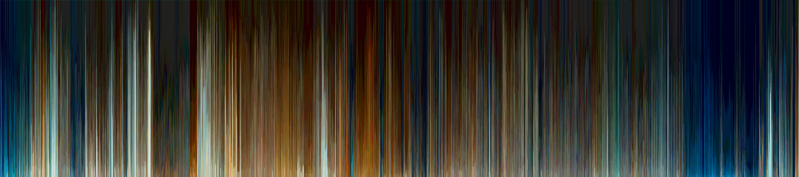

# the-shape-of-movies

This project intends to capture the main colors of movies and display them in a graphic layout. The idea is taken from https://www.theshapeofmovies.com/, itself inspired from https://thecolorsofmotion.com/.

Code is written in C++, and using the Imagine library.

Titanic movie shape:

